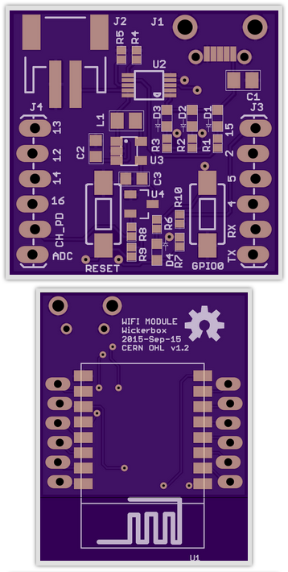

Standalone Wifi IoT Module 
--------------------------

ESP8266 module with battery charge circuit and some basic IO.

*v1 Status*  
- ordered the board Super Swift on 15 Sep 2015
- ordered all the Digikey parts on 15 Sep 2015

This product uses the [ESP8266 ESP-12E](http://www.electrodragon.com/product/esp-12e-esp8266-wifi-board/).

[Schematic PDF](standalone-v1-schematic.pdf)

### Bill of Materials

|RefDes|Qty|Description|Mfr|Mfr P/N|Dist|Dist P/N|
|------|---|-----------|---|-------|----|--------|
|C1,C2|2|CAP CER 4.7UF 10V 20% X5R 0603|Murata|GRM188R61A475ME15D|Digikey|490-10478-1-ND|
|C3|1|CAP CER 10UF 10V 10% X5R 0603|Murata|GRM188R61A106KE69D|Digikey|490-10474-1-ND|
|D1,D4|2|LED RED DIFFUSED 0603 SMD|OSRAM Opto|LS L296-P2Q2-1-Z|Digikey|475-2761-1-ND|
|D2|1|LED SMARTLED AMBER 615NM 0603|OSRAM Opto|LA L296-Q2R2-1-Z|Digikey|475-2712-1-ND|
|D3|1|LED PURE GREEN 0603 SMD|Stanley|BG1111C-TR|Digikey|404-1005-1-ND|
|J1|1|MICRO B USB RECEPTACLE SMT W/ STUDS|Hirose|ZX62D-B-5P8|Digikey|H11610CT-ND|
|J2|1|CONN HEADER PH SIDE 2POS 2MM SMD|JST|S2B-PH-SM4-TB(LF)(SN)|Digikey|455-1749-1-ND|
|L1|1|FIXED IND 4.7UH 600MA 344.5 MOHM|Taiyo|BRC2012T4R7MD|Digikey|587-2907-1-ND|
|R4|1|RES SMD 2K OHM 1% 1/10W 0402|Panasonic|ERJ-2RKF2001X|Digikey|P2.00KLCT-ND|
|R5,R7-R10|5|RES SMD 10K OHM 1% 1/10W 0402|Panasonic|ERJ-2RKF1002X|Digikey|P10.0KLCT-ND|
|R1-R3|3|RES SMD 150 OHM 1% 1/10W 0402|Panasonic|ERJ-2RKF1500X|Digikey|P150LCT-ND|
|RESET,GPIO0|2|SWITCH TACTILE SPST-NO 0.05A 24V|TE Conn|FSMSM|Digikey|450-1140-ND|
|U1|1|ESP8266 ESP-12E WIFI MODULE|ESP8266|ESP-12E|Electrodragon|NWI1040|
|U2|1|IC LI-ION/LI-POLY CTRLR 10MSOP|Microchip|MCP73833-AMI/UN|Digikey|MCP73833-AMI/UN-ND|
|U3|1|IC REG BST 5V 295MA SYNC SOT-25|Torex|XC9140A501MR-G|Digikey|893-1181-1-ND|
|U4|1|IC REG LDO 3.3V 0.25A SOT23A-3|Microchip|MCP1703T-3302E/CB|Digikey|MCP1703T-3302E/CBCT-ND|
